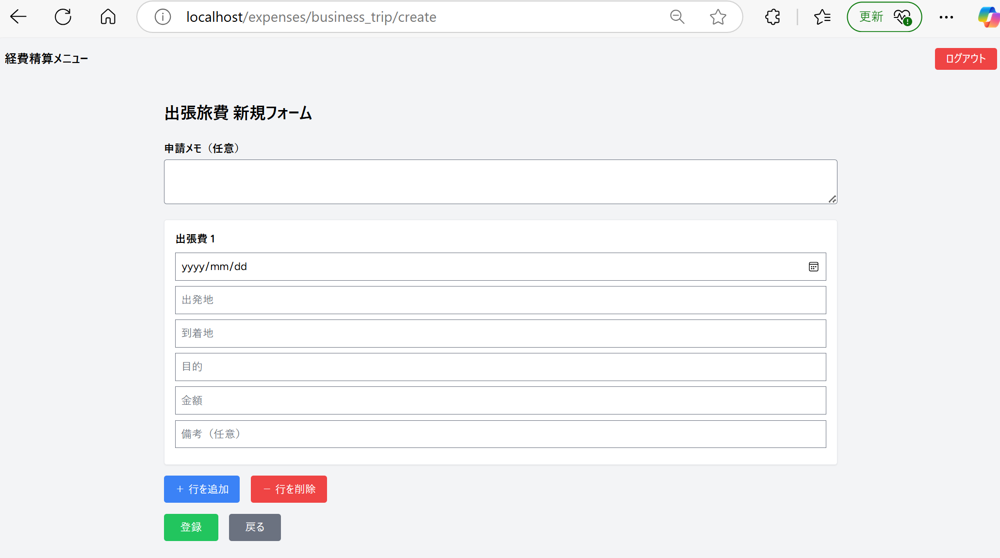
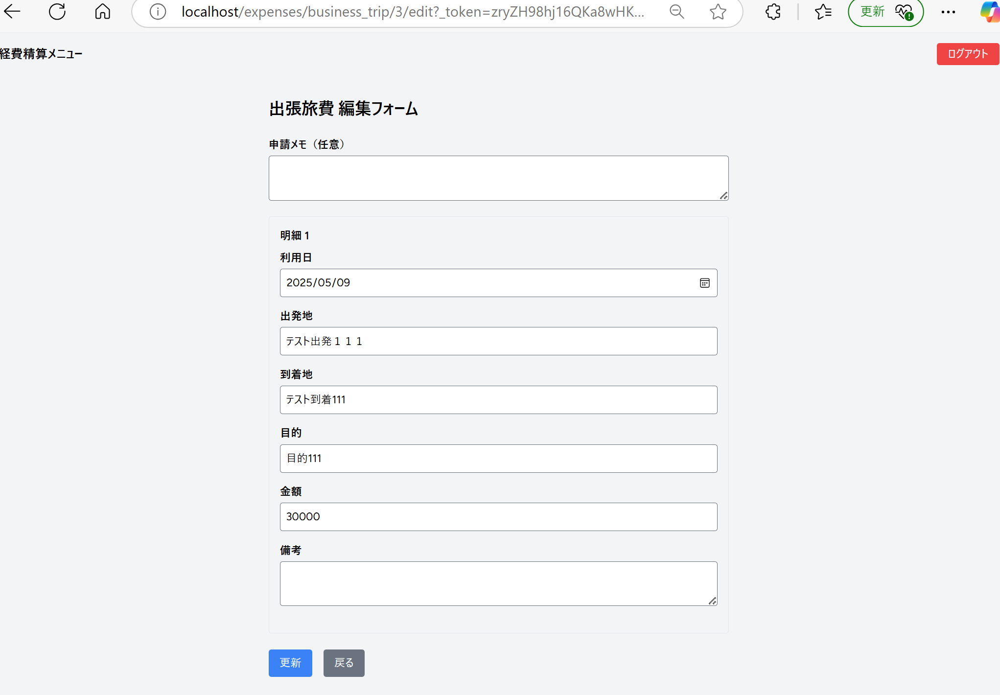

# 経費精算システム（expense-system）

このプロジェクトは Laravel を使った社内向け経費精算アプリケーションです。  
現在、**「出張旅費伝票モジュール」のみ完成済み**です（他のモジュールはリファクタリング中）。

---

## ✅ 対応済み機能（出張旅費）

- ログイン／ログアウト機能（Laravel Breeze 使用）
- 出張旅費の申請（複数明細入力対応）
- 申請一覧／編集／削除
- ログインユーザー別に申請データを管理
- 管理者による全ユーザーの申請閲覧（is_admin フラグ対応）

---

## 📝 設計資料（docsフォルダ）

- 画面遷移図、ルーティング定義、ER図 などを Markdown でまとめています  
→ `docs/` フォルダをご覧ください

---

## ⚙️ 技術構成

- Laravel 10.x / PHP 8.x
- MySQL 8.x
- Docker（Laravel Sail 非使用）
- Blade（Tailwind CSS）
- Laravel Breeze（認証）
- Git / GitHub

---

## 📦 セットアップ手順（Dockerベース）

### 1. リポジトリのクローン

```bash
git clone https://github.com/xxxxx/expense-system.git
cd expense-system
```

### 2. `.env` の作成とビルド

```bash
cp .env.example .env
docker-compose up -d --build
docker-compose exec laravel.test composer install
docker-compose exec laravel.test php artisan key:generate
```

### 3. DBの初期化とマイグレーション

```bash
docker-compose exec laravel.test php artisan migrate --seed
```

もしくは `dump.sql` を利用して初期化：

```bash
docker cp dump.sql expense-system-mysql-1:/dump.sql
docker exec -it expense-system-mysql-1 bash
mysql -u root -p laravel < /dump.sql
```

---

## 🔐 管理者ユーザー作成（Tinker）

```bash
php artisan tinker

>>> \App\Models\User::create([
  'name' => '管理者',
  'email' => 'admin@example.com',
  'password' => bcrypt('password'),
  'is_admin' => true
]);
```

---

## 💡 今後の予定・開発中の機能

- 他モジュール（交通費／接待交際費／備品費）対応中
- コンポーネント化（form inputなど）とUI統一の検討
- Alpine.js → Vue3 への移行構想
- AWS へのデプロイ（検証予定）

---

## 🖼️ 画面キャプチャ（例：出張旅費一覧）

## 🖼️ 画面キャプチャ

### 🔐 ログイン画面
ログインユーザーのみが申請操作可能です（Laravel Breezeによる認証機能）。


---

### 📋 出張旅費一覧画面
自分が申請した出張旅費伝票が一覧表示されます。


---

### 🆕 出張旅費新規登録画面
明細（出張日、出発地、目的地、目的、金額など）を複数入力できます。  
合計金額は自動的に計算されます。



---

### ✏️ 出張旅費編集画面
既存の出張伝票内容を修正できます。明細の複数行にも対応。




---

## 📁 補足

- `.gitignore` により `storage/`, `vendor/` などは Git 管理外です
- メール／検索などの外部連携機能は未導入です

---

## 👨‍💻 作者メモ

本リポジトリは現在も開発中です。  
途中状態ではありますが、「出張旅費モジュール」を一区切りとして公開しています。