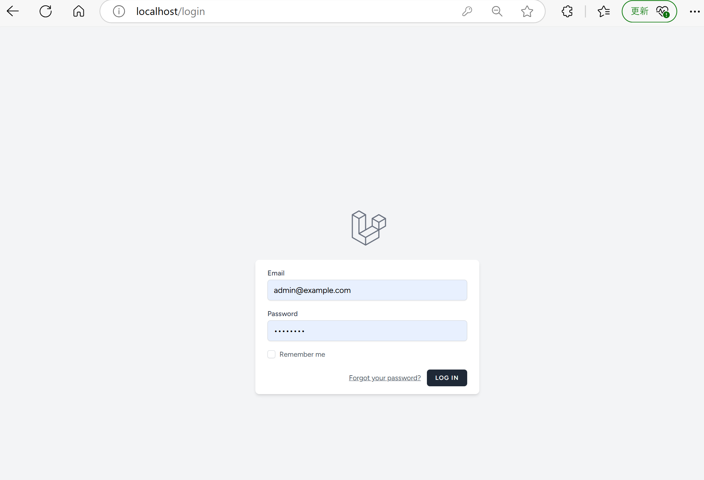
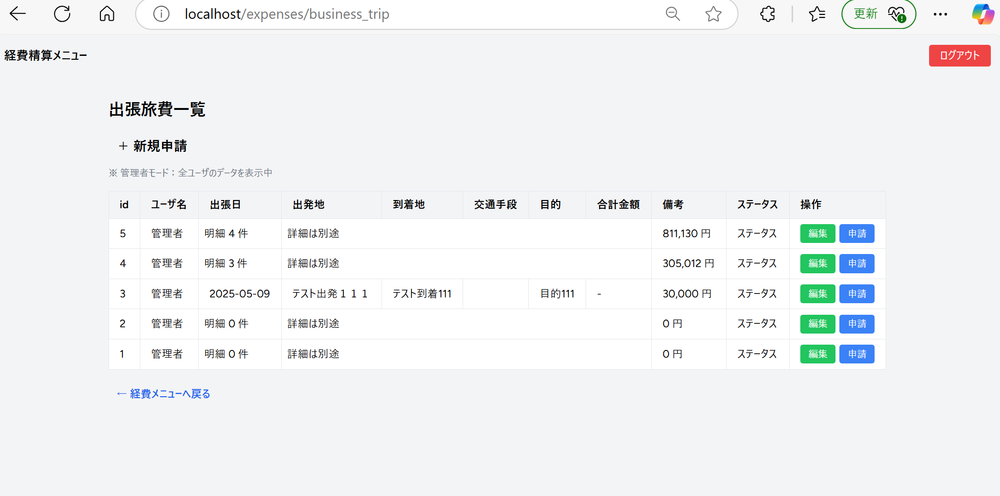

# expense-system（経費精算システム）

このプロジェクトは Laravel を使った経費精算管理システムです。  
備品・交通費・接待交際費・出張旅費などの申請を登録・編集・一覧・削除できる機能を持ちます。

---

## 主な機能

### 1. 経費申請機能

各モジュール（交通費・備品・出張・接待）に応じた入力画面から、日付・金額・品目などを入力し、登録が可能です。

-   一般ユーザは自分の申請だけを閲覧・編集・削除可能
-   登録データは一覧表示され、ページネーション付きで確認できます

### 2. 管理者モード

ログインユーザが管理者の場合、全ユーザの申請データが一覧表示されます。

-   各申請にユーザ名が表示される
-   管理者専用の注意書きが表示される（「管理者モード：全ユーザのデータを表示中」など）

### 3. 認証機能

Laravel Breeze により、ログイン／ログアウト／ユーザ登録／パスワードリセットが可能です。

-   認証後のみ経費申請が利用可能

---

## 権限制御（is_admin）

-   `users` テーブルに `is_admin` カラムを追加し、管理者フラグを制御
-   管理者ユーザは全ユーザの申請データを参照可能
-   一般ユーザは自分が登録した申請データのみ表示
-   管理者ユーザは Tinker 経由で作成可能

```bash
php artisan tinker

>>> \App\Models\User::create([
  'name' => '管理者ユーザ',
  'email' => 'admin@example.com',
  'password' => bcrypt('password'),
  'is_admin' => true
]);
```

---

## 構成技術

-   Laravel 10.x
-   MySQL 8.x
-   Redis

※ Laravel Sail は使用しておらず、`docker-compose` による構成で動作しています。

---

## 必要な環境

-   Docker / Docker Compose
-   Git
-   ブラウザ（Chrome 等）

---

## セットアップ手順

### 1. リポジトリをクローン

```bash
git clone https://github.com/kenji345Sar/expense-system.git
cd expense-system
```

### 2. `.env` 作成と依存パッケージのインストール

```bash
cp .env.example .env
docker-compose up -d --build
docker-compose exec laravel.test composer install
docker-compose exec laravel.test php artisan key:generate
```

### 3. 初期データのインポート（dump.sql を利用）

```bash
# dump.sql をコンテナにコピー
docker cp dump.sql expense-system-mysql-1:/dump.sql

# コンテナに入る
docker exec -it expense-system-mysql-1 bash

# インポート実行
mysql -u root -p laravel < /dump.sql
```

※パスワードは `.env` に記載されている値を使用してください。

---

## 認証機能について

Laravel Breeze（Blade 版）を使用して認証機能を導入しています。

```bash
composer require laravel/breeze --dev
php artisan breeze:install
npm install && npm run build
php artisan migrate
```

ログイン後、各種申請機能（備品・消耗品費など）を利用できます。  
管理者ユーザを作成する場合は上記 Tinker コマンドを参考にしてください。

---

## 画面イメージ

※以下は仮のパスです。実際には `public/images/` 配下などに保存し、画像と一緒に使用してください。

### ログイン画面



### 備品・消耗品費一覧画面（一般ユーザ）


### 交通費一覧画面（一般ユーザ）


### 接待交際費一覧画面（一般ユーザ）


### 出張旅費一覧画面（一般ユーザ）



### 管理者モード画面


---

## 備考

-   `storage/` や `vendor/` ディレクトリは `.gitignore` により Git 管理外です。
-   `meilisearch` や `mailpit` などのサービスは使用していません（docker-compose.yml 上でも除外済み）。
