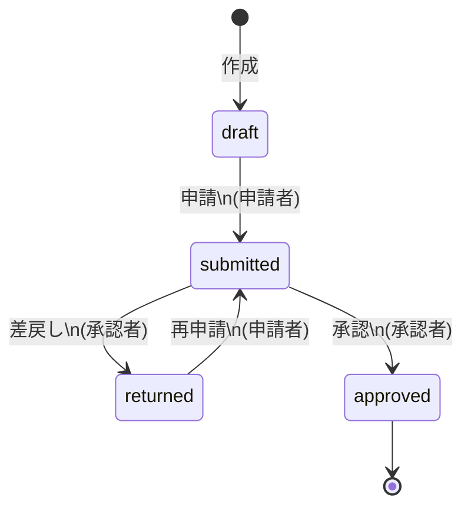

# 承認機能ロジック仕様

## 1. ステータス定義

経費（expenses）は以下のステータスを持つ。

| status    | 日本語 | 説明                  |
| --------- | --- | ------------------- |
| draft     | 下書き | 作成直後の状態。申請者本人のみ操作可能 |
| submitted | 申請中 | 承認待ち状態              |
| approved  | 承認済 | 承認完了                |
| returned  | 差戻し | 承認者により差戻された状態       |




---

## 2. ステータス遷移ルール

経費ステータスは以下のルールで遷移する。

| 遷移元       | 遷移先       | 操作  | 実行者   | 備考           |
| --------- | --------- | --- | ----- | ------------ |
| draft     | submitted | 申請  | 申請者本人 | 初回申請         |
| submitted | approved  | 承認  | 承認者   | 自分承認は現時点では許可 |
| submitted | returned  | 差戻し | 承認者   | 差戻し理由を入力     |
| returned  | submitted | 再申請 | 申請者本人 | 差戻し後の再申請     |

※ 現在は **承認者が自分の申請を承認することを許可**している。
※ 将来的に禁止する可能性がある。

---

## 3. 権限制御

### 申請（submit）

* 実行者：申請者本人のみ
* 実行条件：

  * status = draft
* 処理内容：

  * status を submitted に変更
  * approver_id / approved_at / approval_comment をクリア

---

### 承認（approve）

* 実行者：`is_approver = true` のユーザー（承認者）
  * **※現在の実装**: 暫定的に `is_admin` を使用中（将来 `is_approver` に変更予定）
* 実行条件：

  * status = submitted
* 処理内容：

  * status を approved に変更
  * approver_id, approved_at を設定

---

### 差戻し（return）

* 実行者：`is_approver = true` のユーザー（承認者）
  * **※現在の実装**: 暫定的に `is_admin` を使用中（将来 `is_approver` に変更予定）
* 実行条件：

  * status = submitted
* 処理内容：

  * status を returned に変更
  * approval_comment を設定

---

## 4. 画面仕様

### 4.1 申請一覧画面（/expenses/all）

#### 表示項目

* 伝票番号
* 日付
* 種別
* 申請者
* 金額
* 操作（申請）

#### 操作ボタン表示条件

* 「申請」ボタン

  * status = draft
  * 申請者本人の場合のみ表示

---

### 4.2 承認待ち一覧画面（/approvals）

#### 表示対象

* status = submitted の経費のみ表示

#### 操作

* 承認
* 差戻し（理由入力欄あり）

---

## 5. ルーティング設計

### 申請

```
POST /expenses/{expense}/submit
```

* Controller：ExpenseSubmitController@submit
* 処理：draft → submitted

---

### 承認

```
POST /approvals/{expense}/approve
```

* Controller：ExpenseApprovalController@approve
* 処理：submitted → approved

---

### 差戻し

```
POST /approvals/{expense}/return
```

* Controller：ExpenseApprovalController@return
* 処理：submitted → returned

---

## 6. 補足事項

* 承認機能は経費カテゴリ（交通費・出張旅費・接待交際費・備品消耗品費）に依存せず、共通ロジックとして実装されている。
* Service クラスでステータス遷移を集約し、Controller は操作起点のみを担う構成としている。

---

